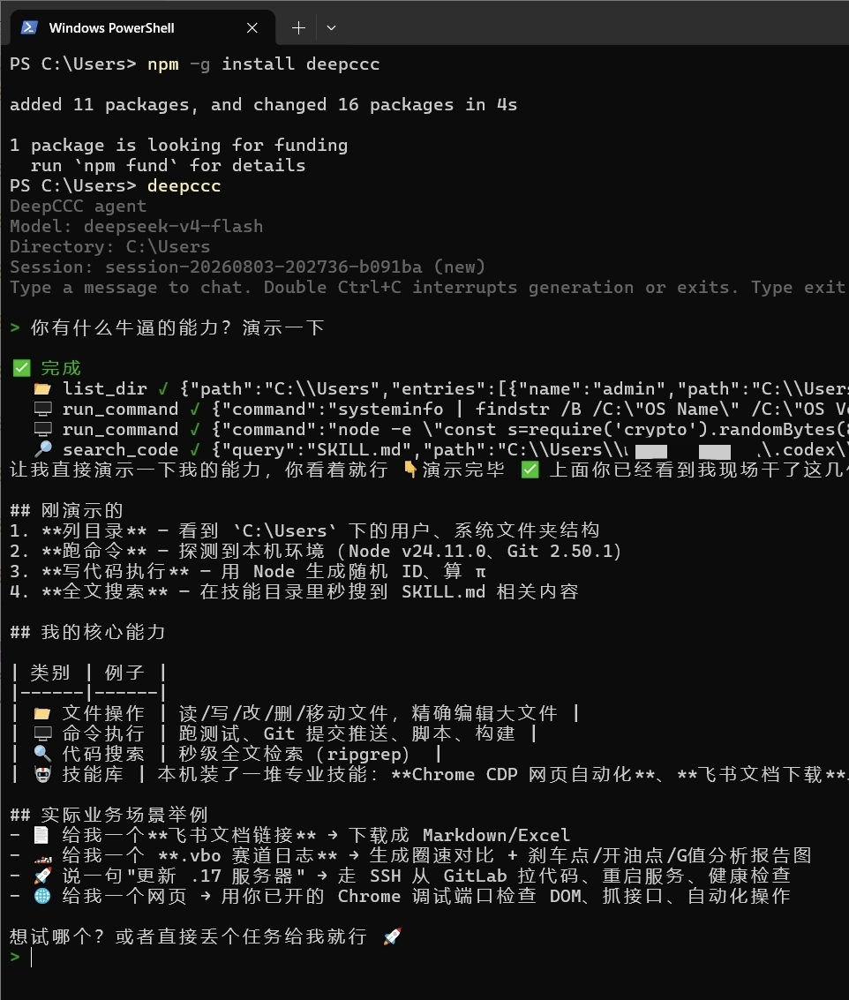
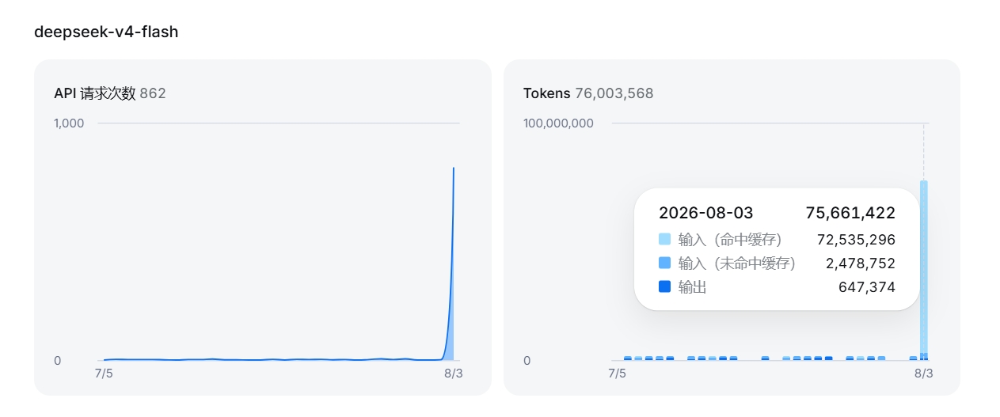

# deepccc

`deepccc` 是一个轻量级本地编程 Agent，针对 DeepSeek 使用体验做了优化，同时支持其他 OpenAI-compatible 模型接口。

它提供交互式命令行、JSONL 流式输出、本地文件工具、命令执行、项目提示词自动注入和持久化上下文。

## 当前状态

代码已经开源在 GitHub：

https://github.com/wzj998/deepccc-agent

npm 包名规划为 `deepccc`。如果 npm 包已经发布，可以直接全局安装：

```bash
npm install -g deepccc
```

如果还没有发布，可以从源码运行：

```bash
git clone https://github.com/wzj998/deepccc-agent.git
cd deepccc-agent
npm install
npm run build
node bin/deepccc.mjs --help
```

运行要求：

- Node.js >= 20
- DeepSeek 或其他 OpenAI-compatible 模型服务的 API Key

## 缓存命中率

deepccc 的本地缓存优化实测命中率 **96.7%**，有效降低重复请求开销，让响应更快、更省成本。





## 配置

最快的方式是使用环境变量：

```bash
export DEEPCCC_API_KEY="sk-..."
export DEEPCCC_BASE_URL="https://api.deepseek.com/v1"
export DEEPCCC_MODEL="deepseek-v4-pro"
export DEEPCCC_EFFORT="high"
export DEEPCCC_MAX_OUTPUT_TOKENS="32768"
export DEEPCCC_STREAMING="true"
```

Windows PowerShell：

```powershell
$env:DEEPCCC_API_KEY="sk-..."
$env:DEEPCCC_PROVIDER="openai"
$env:DEEPCCC_BASE_URL="https://api.deepseek.com/v1"
$env:DEEPCCC_MODEL="deepseek-v4-pro"
$env:DEEPCCC_EFFORT="high"
$env:DEEPCCC_MAX_OUTPUT_TOKENS="32768"
$env:DEEPCCC_STREAMING="true"
```

也兼容这些 DeepSeek 别名：

- `DEEPSEEK_API_KEY`
- `DEEPSEEK_BASE_URL`
- `DEEPSEEK_MODEL`
- `DEEPSEEK_EFFORT`

也可以创建 `~/.deepccc/config.json`：

```json
{
  "provider": "openai",
  "apiKey": "sk-...",
  "baseURL": "https://api.deepseek.com/v1",
  "model": "deepseek-v4-pro",
  "subModel": "",
  "effort": "",
  "maxOutputTokens": null,
  "streaming": true,
  "contextWindow": 1048576,
  "git": {
    "coAuthor": {
      "enabled": true,
      "name": "DeepCCC",
      "email": "20184052+wzj998@users.noreply.github.com"
    }
  },
  "rawStreamLogs": {
    "enabled": true,
    "maxBytesPerTurn": 1048576,
    "retentionDays": 7,
    "keepCompleted": false
  }
}
```

`git.coAuthor.enabled` 默认开启。DeepCCC 通过 `run_command` 创建 Git 提交时会保留用户为
主 Author，并追加 `Co-authored-by: DeepCCC <20184052+wzj998@users.noreply.github.com>`。
可设为 `false` 或用 `DEEPCCC_GIT_COAUTHOR=false` 全局关闭。ChatCCC 的
`ccc.gitCoAuthor` 是三态 override：`null`/缺失跟随这里，`true` 强制开启，`false` 强制关闭。

`provider` 可选 `openai` 或 `anthropic`，默认 `openai`，也可以通过
`DEEPCCC_PROVIDER` 或命令行 `--provider` 覆盖：

- `openai` 使用 OpenAI-compatible Chat Completions 协议，兼容 DeepSeek、OpenAI、LiteLLM、vLLM 等服务。
- `anthropic` 使用 Anthropic Messages 协议。配置中的 `baseURL` **完全按填写值使用，不自动补 `/v1`**，请填写到完整版本化地址，例如 DeepSeek 官方 Anthropic 端点为 `https://api.deepseek.com/anthropic/v1`（官方 Anthropic SDK 使用的 `https://api.deepseek.com/anthropic` 基址会拼接为 `.../anthropic/v1/messages`）。`effort` 在 OpenAI-compatible 模式映射为 `reasoning_effort`，在 Anthropic 模式映射为 `output_config.effort`；目标服务不支持时应留空。

`streaming` 控制主对话是否使用流式请求，默认 `true`；也可以通过
`DEEPCCC_STREAMING=true|false` 覆盖。关闭后，终端会在整条模型响应完成后一次性显示结果。

`maxOutputTokens` 限制主对话单次最大输出 token，默认不配置（`null`/缺失），此时不向
Provider 发送 `max_tokens`，使用模型服务端默认值。可通过 `DEEPCCC_MAX_OUTPUT_TOKENS`
或命令行 `--max-output-tokens` 覆盖；只接受正整数。该限制会同时覆盖模型思考内容、
工具参数和最终回答，设置过小可能导致工具调用或长回复被截断。

`contextWindow` 是模型上下文窗口（token），默认 `1048576`（1M，DeepSeek V4 Pro/Flash
原生规格）；上下文压缩阈值自动 = `contextWindow × 0.8`（超出即把较早消息压缩为摘要）。
可通过 `DEEPCCC_CONTEXT_WINDOW` 环境变量覆盖。⚠️ 超过模型/服务端实际上限时请求会被
API 拒绝（context length exceeded），实际窗口以模型与所用服务端为准（如 litellm 的
`max_input_tokens`）。

`subModel` 是子模型（选填），默认 `""`（留空跟随主模型）。配置后，DeepCCC 内部的轻量
环节——上下文压缩摘要生成、`task` 子代理任务——使用子模型执行，主对话仍用主模型。
典型用法：主模型用 pro 承担复杂推理，子模型用 flash 做高频廉价的摘要与子任务。
可通过 `DEEPCCC_SUB_MODEL` 环境变量或命令行 `--sub-model` 覆盖。

`task` 子代理工具：主模型可把边界清晰的独立子任务（仓库调研、长文档阅读、独立模块生成）
委派给子代理执行——子代理使用子模型、独立上下文，不污染主对话上下文；结果截断回传。
子代理**不能再次委派**（禁止嵌套），单轮最多 20 个工具步，超时与主会话压缩超时一致。
仅在配置了子模型时建议使用（未配置时子代理跟随主模型，节省有限）。

`rawStreamLogs.enabled` 默认 `true`，通过 `DEEPCCC_RAW_STREAM_LOGS` 环境变量或配置 JSON 关闭。
开启时，每次对话的原始流按 gzip JSONL 落到 `~/.deepccc/raw-stream-logs/`，供
`session_search` 工具在会话被压缩后找回被压缩消息的精确原文（检索时设置
`include_raw_logs=true`）。压缩后注入的恢复提示会携带当前会话 ID：优先用
`session_id` 限定只搜当前会话，未命中时可省略 `session_id` 做全库检索。
关闭后，压缩后的旧消息原文将无法找回。

## 命令行交互

在当前目录启动一个交互式 Agent：

```bash
deepccc
```

指定其他模型或 OpenAI-compatible 接口：

```bash
deepccc --base-url https://api.openai.com/v1 --api-key "$OPENAI_API_KEY" --model gpt-4.1
```

使用 Anthropic Messages 协议（同样支持流式输出）：

```bash
deepccc --provider anthropic --base-url https://api.example.com --api-key "$API_KEY" --model claude-sonnet-4-6
```

指定工作目录：

```bash
deepccc --cwd /path/to/project
```

恢复当前工作目录最近一次会话：

```bash
deepccc --resume
```

设置工具调用步数上限：

```bash
deepccc --max-steps 20
```

默认情况下，`deepccc` 不设置固定步数上限，会让模型自然完成工具循环。

设置推理强度（reasoning effort）：

```bash
deepccc --effort high
```

可选值：`none` / `minimal` / `low` / `medium` / `high` / `xhigh` / `max`（留空则不传 `reasoning_effort` 请求字段）。

限制主对话最大输出 token：

```bash
deepccc --max-output-tokens 8192
```

不设置时使用 Provider 默认值。

## 权限机制

`deepccc` 内置轻量权限机制，对标主流 agent 的审批体验：**只拦截有副作用的操作**（`run_command` 与文件写操作），只读工具（`read_file` / `list_dir` / `search_code`）永不拦截，常规文件编辑默认放行不打断工作流。

默认模式（`ask`）下，只有**命中内置危险命令库**的高危命令才会询问，例如：

- `rm -rf` / `rm -fr` / `del /s` / `rmdir /s` 等强制删除
- `git push --force` / `git reset --hard` / `git clean -f` 等破坏性 git 操作
- `format` / `diskpart` / `mkfs` / `dd of=设备` 等磁盘操作
- `shutdown` / `reboot` 等系统操作
- `drop table` / `truncate table` 等数据库操作
- `npm publish` / `npm uninstall -g` / `pip uninstall` 等发布与全局卸载

交互模式下，高危命令会暂停并询问：

```text
⚠️  高危操作需要确认
运行命令: rm -rf node_modules
允许一次(y) / 永远允许(a) / 拒绝(n) / 本会话允许所有(g) >
```

- `y` — 允许本次
- `a` — 永远允许，写入 `~/.deepccc/allow.json`
- `n` — 拒绝本次
- `g` — 本会话内全部放行（不落盘）

### 规则文件 `~/.deepccc/allow.json`

规则格式为 `"<工具>:<模式>"`（`*` 为通配符，`*:` 匹配所有工具），支持相对/绝对路径：

```json
{
  "allow": [
    "run_command:git status*",
    "run_command:git push --force origin release*"
  ],
  "deny": [
    "edit_file:node_modules/**",
    "run_command:npm publish*"
  ]
}
```

`deny` 命中永远拒绝，`allow` 命中永远放行（可覆盖高危判定）。文件变更后自动热加载，无需重启。

### 非交互模式与 bypass

`--stream-json` 或程序化调用（无终端可交互）时，高危命令**安全默认拒绝**。需要全自动场景可显式传入：

```bash
deepccc --dangerously-bypass-permissions
```

该参数与 `ChatSession` 的 `permissionMode: "bypass"` 等价，也是 chatccc 集成 deepccc 时使用的模式（对齐 chatccc 调用 Claude Code / Codex 的 bypass 方式）。

## 终端过程区块

交互模式下，每轮回复渲染为固定"过程区块"：状态行（压缩上下文中/生成回复中/完成/已停止/异常结束）+ 折叠工具行 + 原地更新正文，不滚屏刷 JSON。活动状态有心跳点号动画；完成/停止/异常后区块定型留在屏幕上。

持久化上下文达到 token 阈值时，deepccc 会先按 token 预算保留最近消息，再压缩较早内容；超长历史消息、工具记录和压缩输入会被限长，避免单次摘要请求反复吞入巨量文本。一次压缩最多等待 5 分钟，超时或摘要失败会给出明确错误，不会自动重放用户请求。

如果终端渲染出现异常，可以强制回退为纯文本流式输出：

```bash
deepccc --plain
```

## JSONL 流式输出

JSONL 模式适合脚本、服务端集成或其他上层系统调用：

```bash
deepccc --stream-json --prompt "检查这个仓库并总结测试命令"
```

也可以从 stdin 传入提示词：

```bash
echo "运行测试并解释失败原因" | deepccc --stream-json
```

输出是逐行 JSON：

```jsonl
{"type":"start","session_id":"session-...","mode":"new","cwd":"/repo","model":"deepseek-v4-pro"}
{"type":"status","phase":"compacting"}
{"type":"compact","compactedMessages":12}
{"type":"status","phase":"generating"}
{"type":"text_delta","text":"...","accumulated":"..."}
{"type":"tool_call","id":"call_...","name":"read_file","input":{"path":"package.json"}}
{"type":"tool_result","tool_call_id":"call_...","name":"read_file","content":{},"is_error":false}
{"type":"done","text":"..."}
```

## 在 ChatCCC 中使用

**ChatCCC 已内置 deepccc**：ChatCCC 的 "CCC Agent" 工具直接内嵌 deepccc 的代码（仓库内 `deepccc-agent/` 子目录），以 `permissionMode: "bypass"` 全自动运行，无需单独安装或配置本仓库。

ChatCCC 是一个把 Claude Code / Codex / Cursor / CCC Agent 聚合到飞书/企微等 IM 消息通道的本地机器人框架，提供会话管理、过程卡片、用量统计与隐私替换等能力。

- 公有仓库：https://github.com/wzj998/ChatCCC
- npm 包：`chatccc`（`npm install -g chatccc`）

在 ChatCCC 会话里可以使用隐藏指令创建 `deepccc` Agent 会话：

```text
/new ccc
```

这种方式适合已经在 ChatCCC 里协作的场景：ChatCCC 负责会话入口和消息通道，`deepccc` 负责本地编程 Agent 能力，包括读取项目提示词、运行命令、编辑文件和输出流式结果。

deepccc 的内核主战场在 ChatCCC 仓库的 `deepccc-agent/` 子目录；本仓库（deepccc-agent）是发布镜像，由 ChatCCC 仓库的 `sync-deepccc.mjs` 目录级同步（多的删、少的补、不同的改），之后 `npm run build && npm publish` 发布独立 `deepccc` 包。

## 项目提示词自动注入

会话启动时，`deepccc` 会从当前工作目录读取这些文件，如果存在就注入为项目级提示词：

- `AGENTS.md`
- `AGENTS.local.md`
- `CLAUDE.md`
- `CLAUDE.local.md`

这些内容会放在固定系统提示词之后，作为项目指导使用。

## Skills 自动加载

`deepccc` 会并行扫描本机 **Claude / Codex / Cursor / DeepCCC** 四套生态的目录式 skill（`<name>/SKILL.md`，含 `name` + `description` frontmatter），把索引注入系统提示词；模型在任务匹配时先用 `read_file` 读取 `SKILL.md` 全文再执行。

自动加载的目录（按优先级从低到高排列，扫描时后者覆盖前者）：

| 目录 | 来源 | 级别 |
| --- | --- | --- |
| `~/.claude/skills` | claude | 用户级 |
| `<cwd>/.claude/skills` | claude | 项目级 |
| `~/.cursor/skills` | cursor | 用户级 |
| `<cwd>/.cursor/skills` | cursor | 项目级 |
| `~/.codex/skills` | codex | 用户级 |
| `~/.agents/skills` | codex | 用户级（标准全局目录） |
| `<cwd>/.codex/skills` | codex | 项目级 |
| `~/.deepccc/skills` | deepccc | 用户级 |
| `<cwd>/.deepccc/skills` | deepccc | 项目级 |

**同名去重优先级（高 → 低）：`deepccc` > `codex` > `cursor` > `claude`**；同一来源内：**项目级（project）> 用户级（global）**。扫描时低优先级先入索引、高优先级同名覆盖，天然实现优先级。

扫描带 mtime 热加载缓存：SKILL.md 内容变化自动重读，新技能目录每次扫描立即被发现——因此"创建技能 → 下一次对话自动生效"，无需重启。

需要新建技能时，创建为 Codex 结构：`~/.deepccc/skills/<name>/SKILL.md`（默认，全局）或 `<cwd>/.deepccc/skills/<name>/SKILL.md`（`--scope project`，仅当用户明确要求项目级时）。

## 内置工具

`deepccc` 可以让模型调用这些本地工具：

- 按行读取文件
- 列目录
- 用 ripgrep 搜索代码
- 编辑、创建、删除、移动文件
- 应用 unified diff patch
- 运行非交互式 shell 命令，并返回 stdout、stderr、exitCode 和超时状态
- 联网搜索（`websearch`：DuckDuckGo，免 API key，返回标题 + URL + 摘要）
- 抓取网页并转纯文本（`webfetch`：仅 http/https，自动去 HTML 标签、控制长度与超时）

命令返回非零退出码时不会直接被当成工具异常；模型可以读取结构化结果，继续判断下一步。

## License

Apache-2.0
